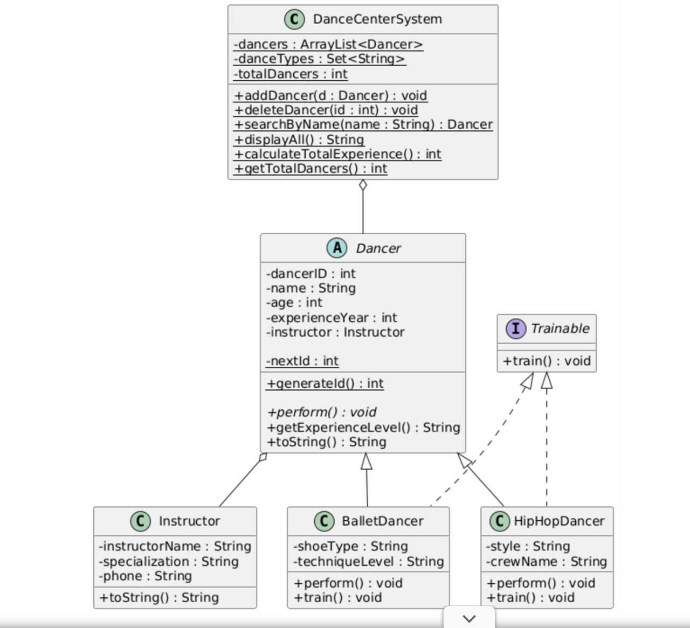

# Dance-Center-Management-System
Developed a Java-based database management system with a graphical user interface (GUI) for managing dance center records. The system includes modules for user authentication(login/registration), and an administrative interface that allows adding, deleting, and searching dancer data. Designed with a focus on Object-Oriented Programming (OOP) principles to ensure organized and efficient data management.

## Project Overview 

The key aspects of this project include:

- The system is a Java-based management tool designed to handle dance center records through a graphical interface
-It includes a functional login and registration module to manage access to the administrative panel
-The main interface allows users to add new dancers, delete existing records, and search for specific entries  
- The user interface is built using the Java Swing library, organized into different frames for each task
- Core Object-Oriented Programming (OOP) concepts like Inheritance and Encapsulation are used to organize dancer types

## UML Diagram


## Tech Stack  

**Language**: Java 
**Technologies**: Java Swing(GUI)   
**Environment**: Eclipse IDE

## Getting Started  

### Prerequisites  

- JDK(Java Development Kid): JDK11 or higher 
- IDE: Eclipse or IntelliJ IDEA

### Installation & Usage
  
- Clone the repository
  ```bash
  git clone https://github.com/meliskulat/Dance-Center-Management-System.git  
  ```

- Open the project in your preffered IDE.
- Run the application.
  


